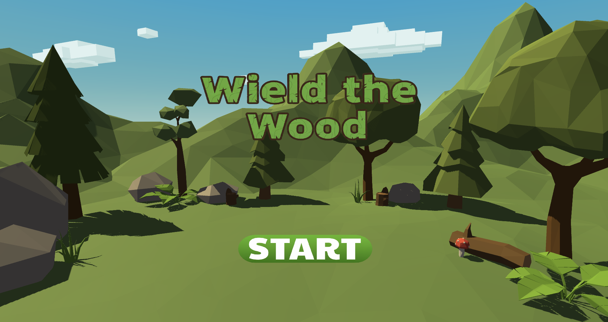
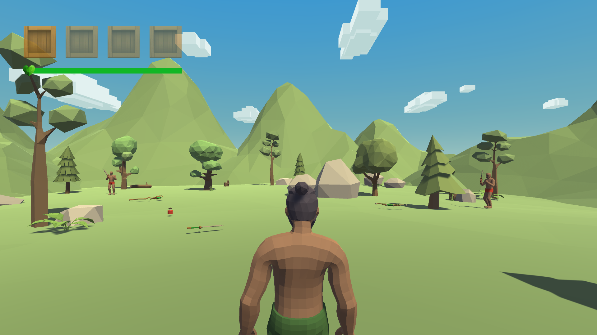
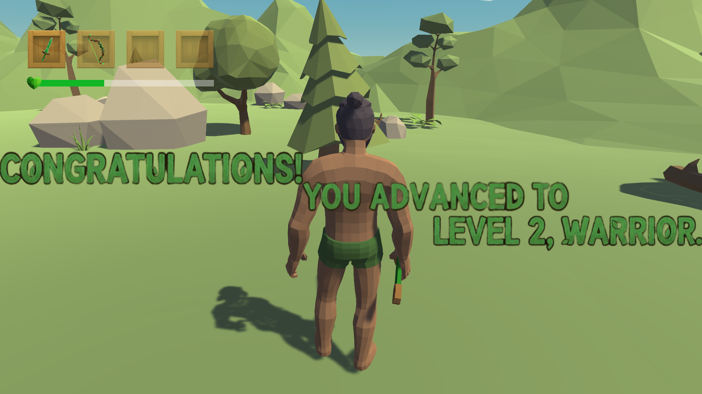
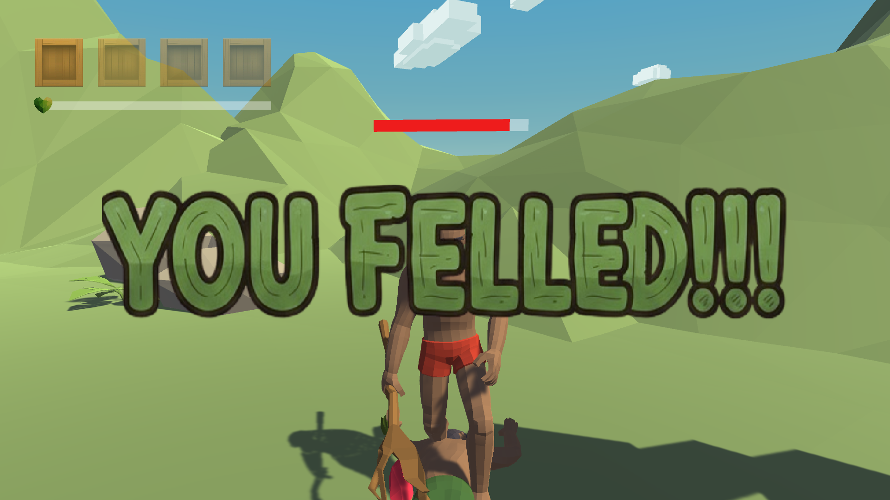

<div align="center">

# 🌲 WIELD THE WOOD 🌲


---




</div>

---

## 🎯 ABOUT THE GAME

<div align="center">

</div>

```diff
+ A brutal third-person combat prototype crafted in Unity
+ This is pure, unfiltered hack-and-slash action
+ No story. No fluff. Just you, your weapon, and enemies to defeat.
```

### 💥 Experience visceral melee combat with:
- ⚡ **Responsive movement system**
- 🗡️ **Dynamic weapon switching**
- 🛡️ **Strategic blocking mechanics**
- 💊 **Health management under pressure**

---

## 🕹️ CONTROLS

<div align="center">

| 🎮 Key | ⚡ Action |
|:------:|:---------|
| **WASD** | Movement |
| **E** | Pick up item |
| **Q** | Drop item |
| **Left Click** | Attack |
| **Right Click** | Block |
| **1 – 4** | Switch inventory slot |

</div>

---

## 🎮 GAMEPLAY PROGRESSION

<div align="center">

</div>

```javascript
// Fight through waves of enemies
while (player.isAlive) {
    masterCombatSkills();
    defeatEnemies();
    becomeWarrior();
}
```

> **🌟 Each victory brings you closer to becoming a true warrior.**

<div align="center">

</div>

```diff
! But remember — death is just another beginning.
! Learn from your mistakes and come back stronger.
```

---

## ⚔️ CORE FEATURES

<div align="center">

| 🎯 COMBAT | 🎒 INVENTORY | 🤖 ENEMY AI | 💚 VISUALS |
|:---------:|:------------:|:-----------:|:----------:|
| Fluid 3rd-person melee | 4-slot system | Intelligent behavior | Clean UI design |
| Multiple weapon types | Quick switching | Dynamic following | Health bar system |
| Defensive blocking | Health potions | Attack patterns | Damage indicators |
| Hit detection | Pick up & drop | Challenging fights | Inventory display |

</div>

---

## 🛠️ TECH STACK

<div align="center">


</div>

---


## 📊 PROJECT STATS

<div align="center">


</div>

---

<div align="center" style="
background:#0d1117;
border:2px solid #4EE31C;
border-radius:18px;
padding:30px;
margin-top:50px;
">


<br/>

<strong style="color:#9AFF9A; letter-spacing:1px;">
Electronic Engineer · Software Developer 
</strong>

<br/><br/>

<a href="https://byandresfabregas.vercel.app/" target="_blank">

</a>

<br/><br/>

<span style="color:#7CFF9B;">
✔ Passionate about creating engaging gameplay experiences
</span>

</div>

---


---

<sub>🌲 Built with Unity · Made with ⚔️ · Combat Focused 🛡️</sub>


</div>
